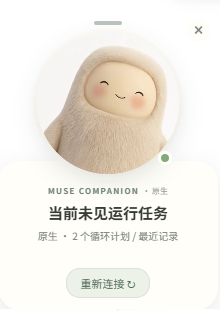
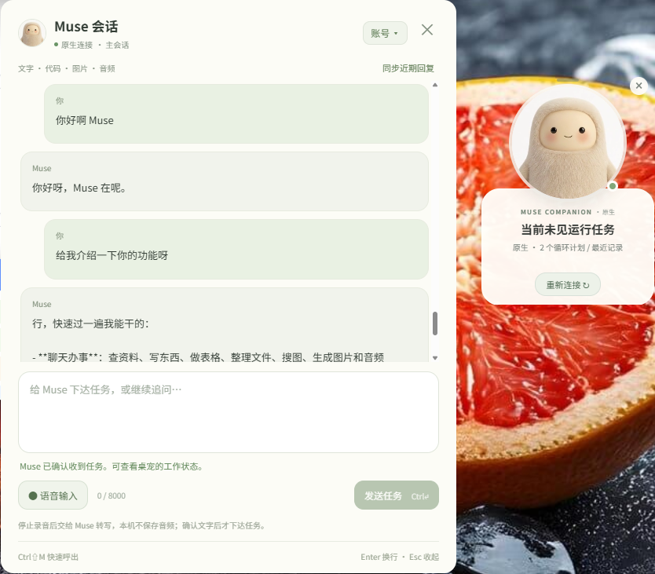

  

<h1 align="center">Muse Desktop Pet</h1>

<strong>简体中文</strong> · <a href="README.en.md">English</a>

  <strong>让 Meta 的 Muse，在你的桌面上有个位置。</strong> 
  看见它的状态，随时与它交谈，让小人陪你把事情做完。 
  An unofficial desktop companion for Muse by Meta.

  
  
  
  
  

  <a href="https://github.com/bayuewind/Muse-desktop-pet/releases/download/v0.1.1/Muse-Desktop-Pet-0.1.1-win-x64-setup.exe"><strong>下载 Windows 版</strong></a>
  · <a href="https://muse.ai/">注册 / 登录 Muse</a>
  · <a href="#getting-started">开始使用</a>
  · <a href="https://github.com/bayuewind/Muse-desktop-pet/issues">反馈问题</a>

---

**Muse Desktop Pet 是基于 Meta 旗下 [Muse 个人 AI 智能体](https://ai.meta.com/muse/)制作的非官方、MIT 开源桌宠。** Muse 提供云端智能体能力，本项目为它增加轻量的桌面形象、任务状态和会话入口；不是另一个 AI 模型，也不是离线运行的 Muse。

> [!IMPORTANT]
> 本项目独立开发，不由 Meta 发布或维护，不代表 Meta 官方客户端。使用前需要拥有可用的 Muse 账号。当前 Windows 安装包是**未签名测试版**，macOS 暂未提供 DMG。

  <a href="#preview">界面预览</a> · <a href="#features">功能特性</a> · <a href="#download">下载</a> · <a href="#getting-started">安装与登录</a> · <a href="#privacy">隐私与安全</a> · <a href="#development">开发</a> · <a href="#faq">常见问题</a>

## 你的桌面，多一个小伙伴

<table>
  <tr>
    <td align="center" width="27%"><strong>一眼看见任务状态</strong></td>
    <td align="center" width="73%"><strong>点开小人，继续对话</strong></td>
  </tr>
  <tr>
    <td align="center" valign="middle"></td>
    <td align="center" valign="middle"></td>
  </tr>
</table>

拖动顶部短横线移动小人；点击小人展开或收起聊天；点击右下角圆点管理账号。会话窗口既能独立拖动，也会跟随小人一起移动。点击截图可查看原图。

## 不只是一张会动的头像

**本地开发版 0.2.0** 新增任务中心、近期成果、目标/灵感、文件与裁切截图、提醒设置和已有旁聊隔离。
它尚未发布到 GitHub，下面的下载链接仍为 0.1.1；新功能、测试范围和本地验收步骤见 [0.2.0 说明](docs/releases/v0.2.0.md)。

| 功能 | 桌宠里的体验 |
| --- | --- |
| 桌面陪伴 | 悬浮小人、状态动画、未读回复提示，以及统一的小人程序 / 托盘图标。 |
| 任务状态 | 查看当前可观察到的会话、子任务与近期运行记录；断线、待同步和未知状态明确区分。 |
| 随时交谈 | 向 Muse 主会话发送文字，只有服务器明确确认后才提示已接收；不确定时保留草稿，不自动重发。 |
| 回复与附件 | 显示文字与代码块，按需预览图片、播放音频和保存文件，不执行附件代码。 |
| 自动连接 | 专用窗口完成登录后自动检测、验证并连接；成功后关闭浏览器，日常使用走原生通道。 |
| 账号管理 | 支持本机登出和切换账号，与日常 Chrome / Edge 的登录资料隔离。 |
| 语音草稿 · 实验性 | 录音转写后先回填输入框，由你检查再发送；实际麦克风与转写链路仍待实机验收。 |

## 下载

| 平台 | 获取方式 | 当前状态 |
| --- | --- | --- |
| Windows x64 | **[下载安装包](https://github.com/bayuewind/Muse-desktop-pet/releases/download/v0.1.1/Muse-Desktop-Pet-0.1.1-win-x64-setup.exe)** | v0.1.1 · 未签名测试版 · 自带运行环境 |
| macOS | [从源码运行](#development) | 暂无 DMG；打包、签名与公证尚未配置 |
| 其他平台 / 架构 | — | 暂未提供安装包或完成验收 |

[发布说明](https://github.com/bayuewind/Muse-desktop-pet/releases/tag/v0.1.1) · [SHA-256 校验文件](https://github.com/bayuewind/Muse-desktop-pet/releases/download/v0.1.1/Muse-Desktop-Pet-0.1.1-win-x64-setup.exe.sha256) · [全部版本](https://github.com/bayuewind/Muse-desktop-pet/releases)

> [!NOTE]
> Windows 用户下载 `.exe` 即可，不需要安装 Node.js，也不需要运行 npm。Releases 中的 `Source code` 是开发者使用的源码压缩包，不是安装程序。

未签名包可能触发 Windows 的未知发布者提示。请确认下载来自本仓库、核对校验值；不要通过关闭系统防护来解决提示。当前不含应用内自动更新，升级请下载新安装包。

## 从账号到桌宠，三步开始

### 1. 准备 Muse 账号

**Muse 官方账号注册 / 登录入口：[muse.ai](https://muse.ai/)**

前往官网，按页面提示创建或登录账号，并确认可以进入 Muse 聊天。账号开通、服务可用地区、资格及订阅要求以官方页面为准；本项目不提供账号、邀请码或额外服务额度。

想先了解 Muse？阅读 [Meta 官方产品介绍](https://ai.meta.com/muse/)或[官方发布文章](https://about.fb.com/news/2026/09/introducing-muse-personal-ai-agent/)。如果需要的是 Meta 官方应用，请使用 [Muse 官方下载入口](https://ai.meta.com/muse/download/)，与本项目的安装包区分。

### 2. 安装并启动桌宠

下载并运行 Windows 安装包，按向导选择安装目录。最后一页可以独立勾选：

- **启动 Muse 桌宠**
- **创建桌面快捷方式**

覆盖升级前先从托盘退出旧桌宠，无需先登出账号。开始菜单也会保留程序入口；卸载默认保留本机授权，需要清除时请先在应用内登出。

### 3. 登录一次，之后原生连接

1. 点击桌宠「登录 Muse」，或「小圆点 → 账号 → 登录 Muse…」。
2. 在新开的**专用浏览器窗口**中自行完成登录和验证码；Windows 支持 Chrome / Edge，macOS 使用 Google Chrome。
3. 进入 Muse 聊天后，桌宠每 2 秒检查一次，验证身份与连接成功后自动保存授权、关闭专用窗口并连接 Muse，无需再点“我已登录”。

这是与日常浏览器分开的登录会话，即使官网已登录，桌宠首次授权仍需要在专用窗口完成。已有有效本机授权时，之后启动会直接恢复原生连接。

> [!TIP]
> 自动检测最多等待 15 分钟。检测超时或验证失败时，查看桌宠上的提示，或使用「账号 → 手动检查并连接（备用）」。当前仅支持已实现验证的 **standard VM**；CVM / SNP 不会跳过验证。

### 常用操作

| 操作 | Windows | macOS |
| --- | --- | --- |
| 展开 / 收起会话 | `Ctrl+Shift+M` | `⌘⇧M` |
| 发送文字 | `Ctrl+Enter` | `⌘Enter` |
| 换行 | `Enter` | `Enter` |
| 收起会话或气泡菜单 | `Esc` | `Esc` |

点击 × 是**隐藏**桌宠；彻底退出请使用托盘 / 菜单栏的「退出桌宠」。「登出当前账号」则会清除本机授权，是另一项操作。

## 连接方式与隐私

**Electron 负责桌面界面，Node 负责原生连接，Chrome / Edge 只负责首次授权。** 授权后，状态、聊天与附件通过原生加密通道连接 Muse，不依赖常驻网页。详情见[原生连接说明](desktop-pet/native/README.md)。

- **独立会话**：不读取日常浏览器的 Cookie、历史记录或已有标签页；仅导入本次专用会话中的 Muse 授权。
- **系统加密**：凭据通过 Electron `safeStorage` 加密，Windows 使用 DPAPI、macOS 使用系统钥匙串保护；不进入代码仓库。
- **安全边界保留**：登录浏览器使用私有管道，不开放调试 TCP 端口，不伪造 User-Agent，不关闭 TLS 校验、沙箱或站点隔离。
- **内容由你控制**：聊天和未保存附件仅在进程内缓存；文件需手动保存，音频不自动播放，语音转写结果需确认后才作为任务发送。
- **本地退出不影响云端任务**：退出或本机登出不会停止 Muse 云端任务、删除云端聊天，也不等于撤销服务器上的所有会话。

本机授权目录：Windows 为 `%APPDATA%\MuseDesktopPet`；macOS 为 `~/Library/Application Support/MuseDesktopPet`。**请勿把这些目录、Cookie 或令牌上传到 Issues。** Muse 服务端的数据处理以其官方政策为准，桌宠并不是完全离线的软件。

## 开发与验证

源码运行需要 **Node.js ≥ 22.12.0**、npm，以及前述 Muse 账号与首次授权浏览器。

~~~sh
git clone https://github.com/bayuewind/Muse-desktop-pet.git
cd Muse-desktop-pet/desktop-pet
npm ci
npm start
~~~

显式要求启动后打开登录窗口：`npm start -- --login`。Windows 也可使用源码目录里的 [启动桌宠-Windows.cmd](desktop-pet/启动桌宠-Windows.cmd)；这个脚本与自带运行环境的 EXE 安装包不同，仍需要 Node.js。

<strong>运行测试与构建 Windows 安装包</strong>

在 `desktop-pet` 目录运行：

~~~sh
npm test                          # 单元测试
npm run smoke                     # 本地窗口、隔离与运行依赖检查
npm run smoke:workspace           # 工作区、会话隔离、截图裁切与静音音频检查
npm run smoke:browser             # Chrome 专用可见窗口检查
npm run smoke:browser -- --edge    # Edge 专用可见窗口检查
npm run dist:win                  # 生成 Windows x64 安装包
npm run verify:win                # 检查打包内容、启动打包程序并生成 SHA-256
~~~

浏览器测试会打开并自动关闭独立测试窗口，不读取 Cookie 或提交登录。打包后验证会检查窗口、依赖、图标及 Windows 加密往返，不安装软件或清除现有授权。

产物位于 `desktop-pet/dist/`：`Muse-Desktop-Pet-<版本>-win-x64-setup.exe` 及同名 `.sha256`。构建命令默认**不会发布到 GitHub**，当前配置生成未签名测试包。后续构建会随包附带本项目的 MIT 许可证文件。

<strong>项目结构与技术说明</strong>

| 位置 | 内容 |
| --- | --- |
| [desktop-pet/](desktop-pet/) | Electron 主进程、桌宠与会话界面 |
| [desktop-pet/native/](desktop-pet/native/) | 原生授权、Noise 通道、状态、消息与附件 |
| [desktop-pet/test/](desktop-pet/test/) | 协议、生命周期、并发与打包测试 |
| [desktop-pet/build/](desktop-pet/build/) | Windows 安装完成页配置 |
| [desktop-pet/assets/](desktop-pet/assets/) | 小人图标与素材来源说明 |
| [docs/](docs/) | 展示截图、发布说明与研究记录 |

更多细节：[完整使用说明](desktop-pet/README.md) · [原生验证边界](desktop-pet/native/README.md) · [v0.1.1 更新记录](docs/releases/v0.1.1.md)

**已验证：** 2026-09-29，Windows 上 98 项自动测试、打包程序冒烟测试及 Chrome / Edge 可见窗口检查通过。自动登录的取消、并发和失败路径通过模拟测试，未为测试而登出已有真实账号。

**仍需验收：** 实际麦克风转写、全天候运行、真实断网及休眠恢复。当前依赖 Muse 私有协议与配对页面结构，服务更新可能需要适配。

## 常见问题

<strong>这是 Meta 官方出的桌宠吗？</strong>

不是。Muse 是 Meta 的产品，本仓库是围绕 Muse 制作的独立、非官方桌面伴侣，不提供或替代官方账号服务。官方产品介绍与账号入口见上方「准备 Muse 账号」。

<strong>为什么用了 Electron，还需要 Chrome / Edge？</strong>

Electron 用来显示桌宠。当前登录适配使用真实浏览器的独立会话，因为测试中内嵌登录曾收到 4xx。完成授权后会关闭专用窗口，日常运行不需要 Chrome / Edge 常驻，也不会复用你日常浏览器的账号。

<strong>“当前未见运行任务”是不是代表所有任务都结束了？</strong>

不是。它只描述当前可观察到的会话、子任务与近期运行记录，不是全账号、无限历史的空闲保证。断线、数据过期或覆盖不足时会显示未知 / 待同步；电脑休眠时本地程序也会暂停。

<strong>语音输入会直接把我说的话发成任务吗？</strong>

不会。录音转写后先回填输入框，你可以编辑并确认发送。录音仅在主动点击后开始，不是持续监听或实时语音通话；此功能尚待实际麦克风与转写验收。

<strong>旧版浏览器监听模式还能用吗？</strong>

`npm start -- --browser` 可显式选择旧版兼容模式，需要专用浏览器持续运行。默认原生模式失败时不会偷偷回退到浏览器监听。限制与排查方法见[完整使用说明](desktop-pet/README.md)。

## 反馈与参与

欢迎通过 [Issues](https://github.com/bayuewind/Muse-desktop-pet/issues) 反馈问题或提出建议，也欢迎提交改进文档和代码的 Pull Request。

反馈时尽量包含：系统与架构、桌宠版本、复现步骤、预期 / 实际表现，以及**脱敏后**的截图或错误信息。涉及凭据、个人聊天或隐私的问题，请勿附带原始会话目录、Cookie、令牌或完整日志。

## 致谢与许可证

- **[Muse by Meta](https://ai.meta.com/muse/)**：本项目连接的智能体服务与小人形象来源；官方账号入口为 [muse.ai](https://muse.ai/)。
- **Electron、Puppeteer 及相关依赖**：提供桌面运行与专用登录窗口能力，依赖的许可证以各自项目为准。
- **项目源代码采用 [MIT License](LICENSE)**，Copyright © 2026 bayuewind。
- **品牌与素材**：Muse 名称、角色形象及第三方素材归各自权利人所有，不因本项目的 MIT 许可证而改变归属，也不代表 Meta 对本项目的认可或授权。图标来源见[素材说明](desktop-pet/assets/README.md)。

Made for your desktop. Powered by your Muse.

