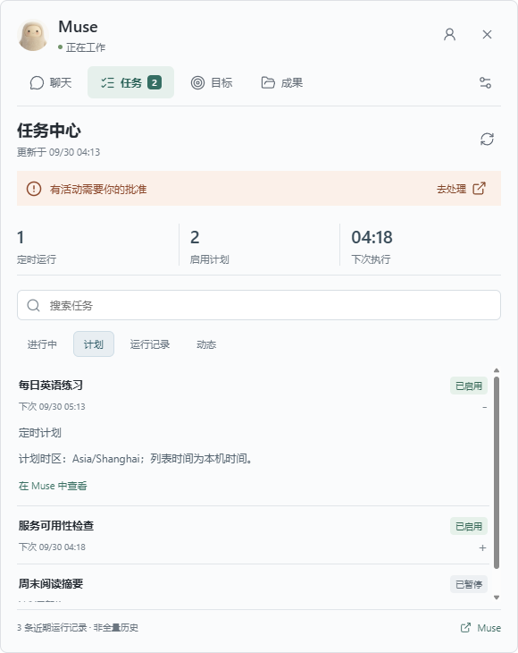
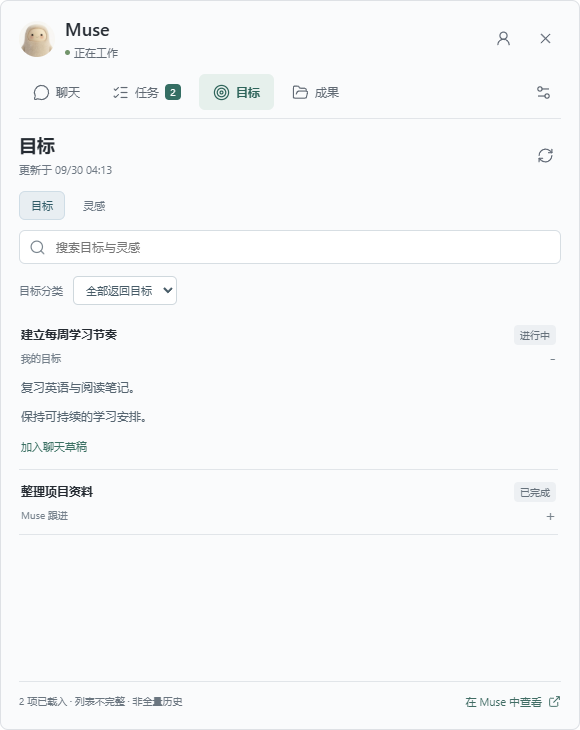

# 0.2.0 本地验收版

这是 `codex/desktop-cloud-experience` 分支的本地交付，不是已经发布的 GitHub Release。
Windows x64 安装包仍未签名；不要求关闭系统安全防护。

## 产物与启动

- 安装包：`desktop-pet/dist/Muse-Desktop-Pet-0.2.0-win-x64-setup.exe`
- 校验：同目录同名 `.sha256`
- 不安装直接运行：`desktop-pet/dist/win-unpacked/MuseDesktopPet.exe`
- 源码：进入 `desktop-pet` 运行 `npm start`。

升级前从托盘退出旧版，不要为升级而登出。新包使用原有 OS 加密授权目录；
没有授权时保持未登录，不读取日常 Chrome/Edge 的资料。退出桌宠不会停止云端任务。

## 本轮功能

| 入口 | 可以验收的体验 |
| --- | --- |
| 桌宠右侧气泡 | 账号、任务、成果、设置四个可用入口 |
| 聊天 | 主会话与已有旁聊选择，独立草稿；Ctrl+Enter 发送，未知送达不自动重试 |
| 输入工具 | 附件选择/拖放/粘贴图片，屏幕截图/裁切/数字区域编辑；4 个文件、合计 8 MB |
| 任务 | 当前活动、计划、近期运行记录、动态；关键词搜索、详情和同步状态 |
| 成果 | 当前选中会话近期附件分类/搜索，预览、保存、音频倍速/重播 |
| 目标 | 目标与灵感列表、详情、筛选、加入草稿，不自动发送或修改目标 |
| 设置 | 通知开关、1/8 小时免打扰、官网资源库和审批入口 |

旁聊是实验性功能：只支持已有、未归档的旁聊，不创建/归档/删除。
一次监听主会话及当前旁聊，不提供全部会话的实时全局未读数。
每次旁聊发送前核对服务器返回的会话身份；失联时可点同步近期回复重连。
最多 8 个会话保留本地附件，切换不混用文件，登出/退出清除所有内存内容。

## 验收顺序

1. 启动后确认原生连接；打开任务页，比较更新时间、计划和运行记录。数据过期应明确提示。
2. 在目标页搜索，展开详情，点击加入草稿。已有文字应保留，消息不应自动发送。
3. 添加一个无敏感信息的小文件；取消发送确认应保留草稿和附件。此步骤涉及真实发送时由你决定。
4. 主动点截图，选择区域，取消应不新增附件；加入消息后仍需单独确认发送。
5. 若账号已有旁聊，分别写两份草稿并切换，验证不互相覆盖；真实收发由你确认。
6. 加载收到的音频，调整倍速、重播、切换页签；离开后应停止播放，不自动恢复。
7. 语音仅主动点击才申请权限。转写结果先回到草稿；取消后不得追加迟到结果。
8. 在系统允许通知的条件下验收完成/失败/待处理通知，以及免打扰。正文和附件名不应进入通知。

## 已验证与限制

- 本次 `npm test`：**154/154 通过**；`npm run smoke:workspace` 通过；
  `npm run dist:win` 与 `npm run verify:win` 通过。
- 包内 **51 个项目运行文件**与已测试源码逐字节一致；Lucide、原生模型、
  文件/截图/会话/音频模块均在包内；排除了账号资料、调试脚本和测试文件。
- 打包程序的正常原生启动也已核对：进入连接/同步后读取 2 个启用计划与 100 条近期运行记录。
  当前保留本地新版运行，未安装覆盖旧版。
- 安装包大小 **116,457,877 字节**，SHA-256：
  `3e1461ecdfc6f16d7de9bb4da8e9d3683e76838a27d0ef87d9f9455355da7f5b`。
- 自动测试和窗口烟测覆盖协议、生命周期、未知状态、审批禁发、输入校验、
  会话隔离、取消竞态、草稿保留、注入防护、截图像素、静音 WAV 实际播放与重播。
- 窗口检查使用合成数据，580×730、440×540；截图在本地忽略目录
  `desktop-pet/.test-output/workspace/`，不是用户聊天截图。
- 真实只读原生连接已确认任务、活动、目标、灵感、会话列表和主会话详情身份；
  此账号返回 1 个目标、39 个灵感和 1 个主会话，无旁聊。
- **没有为了测试发送云端消息、上传用户文件、录制真实麦克风、批准请求或新建旁聊。**
  真实附件发送、旁聊收发、系统截图权限、语音转写、系统通知呈现仍需用户验收。
- 任务中心是近期可观察记录；目标/灵感是有界返回列表；成果是当前会话近期附件。
  不冒充完整账号历史或全量云端文件库。
- 原生审批、任务创建/暂停、连接器授权、目标修改未实现，保留官网处理入口。
  Muse 私有协议更新可能需要适配；真实断网、睡眠唤醒、全天稳定性仍需长期观察。
- 新版 Windows 产物完成自动打包验证不等于完成安装向导和所有真实账号操作验收；
  本轮不会安装覆盖用户程序或自动发布。

详细过程与阶段提交见 [工作记录](../desktop-cloud-experience-plan.md)。

## 界面

下图全部为自动验收生成的合成数据，不包含用户聊天或任务内容。

